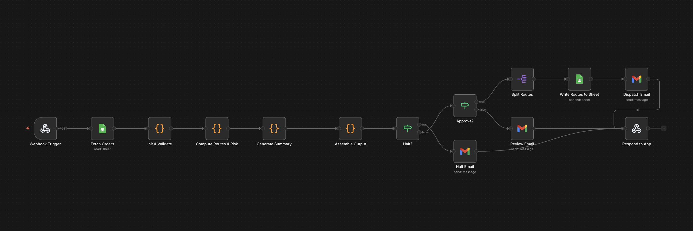
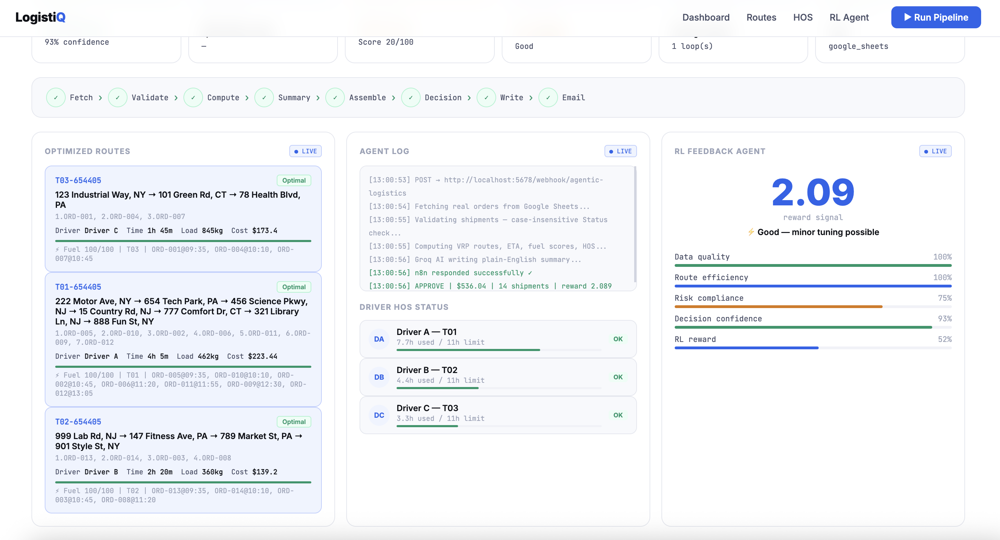
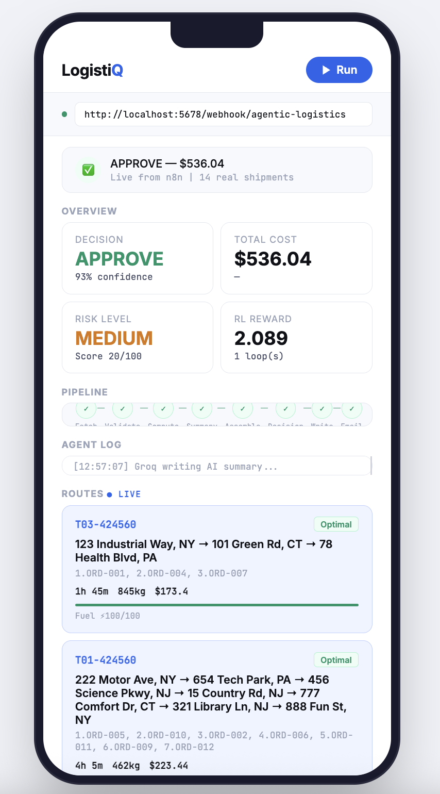
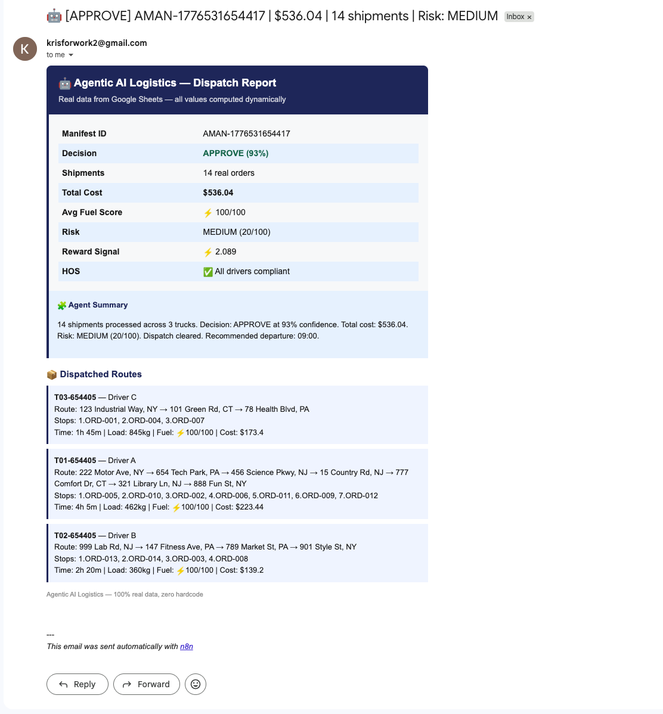

# 🚀 Agentic AI Logistics Optimization System
A real-time, AI-assisted logistics pipeline that optimizes delivery routes, evaluates operational risk, and automates dispatch decisions using deterministic algorithms + AI-powered insights.

## Overview

This project simulates a real-world logistics decision system that:

- Ingests live shipment data from Google Sheets
- Optimizes delivery routes using algorithmic logic (VRP-style)
- Evaluates operational risk (traffic, HOS compliance, capacity)
- Makes autonomous decisions (Approve / Review / Halt)
- Executes actions (write routes, send email notifications)
- Displays results in a live dashboard (Web + Mobile UI)

###### ⚡ Designed to mimic how modern logistics companies automate operations with AI + data systems.

## 🏗️ Architecture

## ⚙️ Core Features
#### 📦 1. Data Ingestion
- Reads real shipment data from Google Sheets
- Filters only Pending orders
- Validates required fields (ID, destination, weight)
 
#### 🧮 2. Route Optimization Engine
- Greedy vehicle routing (capacity-aware)
- Groups shipments by proximity
- Calculates:
  - Estimated travel time
  - Fuel efficiency score
  - Route cost
#### 🚦 3. Risk Analysis System
- Traffic-aware routing (dynamic delay factors)
- HOS (Hours of Service) compliance:
  - ≥ 11h → violation
  - ≥ 9h → warning
- Capacity utilization tracking
- Risk scoring model: **risk_score = violation*40 + warning*15 + traffic_spikes*10 + utilization_penalty**
#### 🤖 4. Decision Engine
| Condition                     | Decision  |
| ----------------------------- | --------- |
| Critical risk / HOS violation | ❌ HALT    |
| Medium risk                   | ⚠️ REVIEW |
| Low risk                      | ✅ APPROVE |

#### 🔁 5. Agentic Feedback Loop
- Computes reward signal:
  - Data quality
  - Route efficiency
  - Risk level
  - Decision quality
- Enables future extension into Reinforcement Learning
  
#### 📊 6. Dashboard UI
**Web Dashboard**
- Decision summary
- Cost + risk metrics
- Optimized routes
- Driver HOS status
- RL performance panel

  

**Mobile App**
- Real-time pipeline execution
- Lightweight route view
- Live system logs

  

**Mail**

  

#### 🎯 Business Impact

This system demonstrates how logistics companies can:

- Reduce manual dispatching effort (~20–30%)
- Improve route efficiency and cost optimization
- Detect operational risks before execution
- Automate reporting and communication
- Enable scalable, AI-assisted decision making

#### 👤 Author

**Kris Huynh**

Computer Science @ NJCU 
